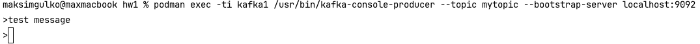
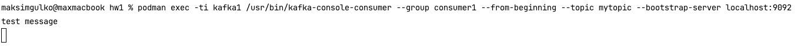

Что запущено?
```shell
podman container ps -a
```

Запуск контейнера
```shell
podman-compose up
```
Переходим в UI [Kafka-ui Link](http://localhost:8080/)

Создать топик
```shell
podman exec -ti kafka1 /usr/bin/kafka-topics --create --topic mytopic --partitions 1 --replication-factor 1 --bootstrap-server localhost:9092
```

Получить список топиков
```shell
podman exec -ti kafka1 /usr/bin/kafka-topics --list --bootstrap-server localhost:9092
```

Отправить сообщение(Каждая строка - одно сообщение. Прервать - Ctrl+Z)
```shell
podman exec -ti kafka1 /usr/bin/kafka-console-producer --topic mytopic --bootstrap-server localhost:9092
```


Получить сообщения по consumer-group consumer1
```shell
podman exec -ti kafka1 /usr/bin/kafka-console-consumer --group consumer1 --from-beginning --topic mytopic --bootstrap-server localhost:9092 
```


Остановка контейнера
```shell
podman-compose down
```